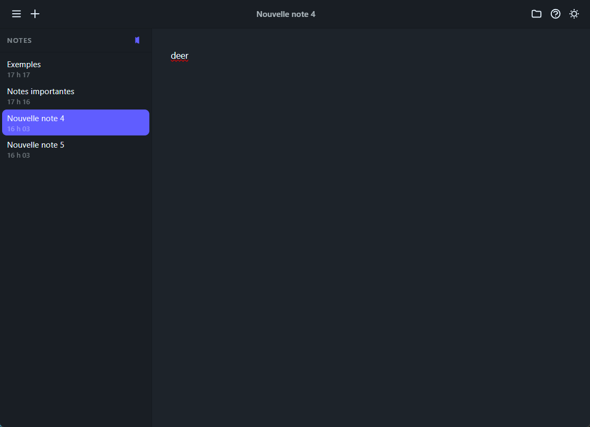

# 🌿 Pluma

Une application de prise de notes légère et élégante, construite avec **Wails**, **SolidJS**, **Tiptap** et **DaisyUI**.

---



## ✨ Fonctionnalités

- 📁 Stockage des notes dans un dossier local de votre choix (fichiers `.html`)
- 📝 Éditeur de texte riche avec **Tiptap**
- 🖼️ Collage d'images directement dans l'éditeur (`Ctrl+V`)
- 🔗 Insertion de liens cliquables (`Ctrl+K`)
- 🌙 Thème clair / sombre
- 📂 Sidebar dépliable et épingnable
- ✏️ Renommage des notes directement dans la toolbar
- 🗑️ Suppression avec confirmation
- 🕐 Date de dernière modification affichée dans la sidebar
- 📅 Notes triées de la plus récente à la plus ancienne
- 💾 Sauvegarde automatique

---

## ⌨️ Raccourcis clavier

| Raccourci     | Action                   |
| ------------- | ------------------------ |
| `Ctrl+N`      | Nouvelle note            |
| `Ctrl+B`      | Gras                     |
| `Ctrl+I`      | Italique                 |
| `Ctrl+K`      | Insérer un lien          |
| `Ctrl+/`      | Ouvrir/fermer la sidebar |
| `Ctrl+Delete` | Supprimer la note active |
| `Ctrl+Z`      | Annuler                  |
| `Ctrl+Y`      | Rétablir                 |
| `F1`          | Ouvrir/fermer l'aide     |

---

## 🛠️ Stack technique

| Couche   | Technologie                                                                         |
| -------- | ----------------------------------------------------------------------------------- |
| Backend  | [Go](https://golang.org/) + [Wails v2](https://wails.io/)                           |
| Frontend | [SolidJS](https://www.solidjs.com/) + [TypeScript](https://www.typescriptlang.org/) |
| Éditeur  | [Tiptap](https://tiptap.dev/)                                                       |
| CSS      | [Tailwind CSS v4](https://tailwindcss.com/) + [DaisyUI v5](https://daisyui.com/)    |
| Build    | [Vite 7](https://vitejs.dev/)                                                       |

---

## 🚀 Démarrage

### Prérequis

- [Go 1.21+](https://golang.org/dl/)
- [Node.js 18+](https://nodejs.org/)
- [Wails CLI v2](https://wails.io/docs/gettingstarted/installation)

```bash
go install github.com/wailsapp/wails/v2/cmd/wails@latest
```

### Installation

```bash
# Cloner le projet
git clone https://github.com/ton-user/pluma.git
cd pluma

# Installer les dépendances frontend
cd frontend
npm install
cd ..
```

### Développement

```bash
wails dev
```

### Build de production

```bash
wails build
```

L'exécutable se trouve dans `build/bin/`.

---

## 📁 Structure du projet

```
pluma/
├── app.go              # Backend Go — logique CRUD des notes
├── main.go             # Point d'entrée Wails
├── frontend/
│   ├── src/
│   │   ├── App.tsx               # Composant racine
│   │   ├── components/
│   │   │   ├── Toolbar.tsx       # Barre d'outils
│   │   │   ├── Sidebar.tsx       # Liste des notes
│   │   │   ├── Editor.tsx        # Éditeur Tiptap
│   │   │   ├── LinkModal.tsx     # Modal insertion de lien
│   │   │   └── HelpModal.tsx     # Modal raccourcis clavier
│   │   └── index.css             # Styles globaux
│   ├── package.json
│   └── vite.config.ts
└── wails.json
```

---

## 📝 Notes

- Les notes sont stockées sous forme de fichiers `.html` dans le dossier choisi par l'utilisateur.
- Les images collées sont encodées en **base64** directement dans le fichier HTML.
- Le dossier de stockage est mémorisé entre les sessions via `localStorage`.
- Le thème (clair/sombre) est également mémorisé entre les sessions.
